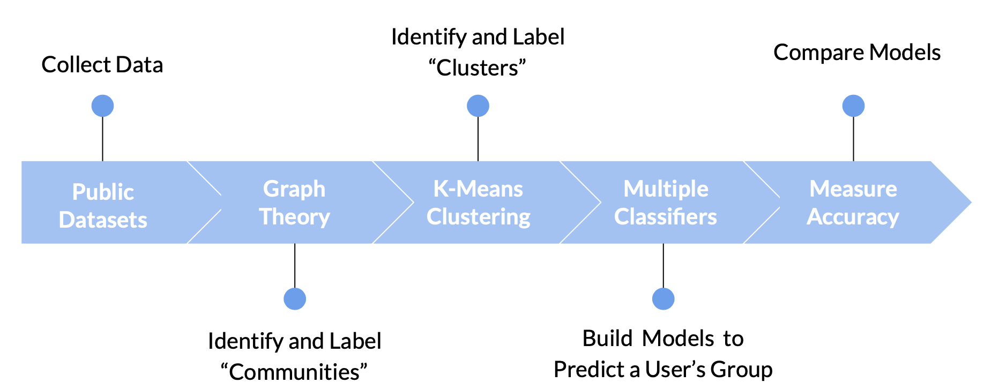
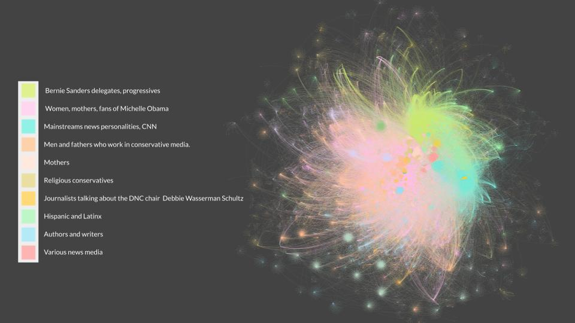
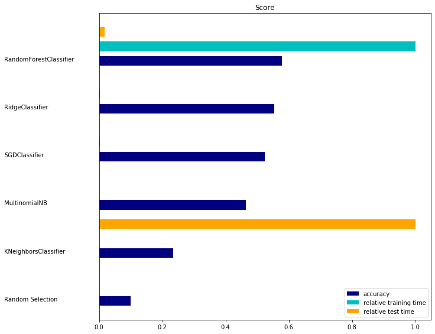
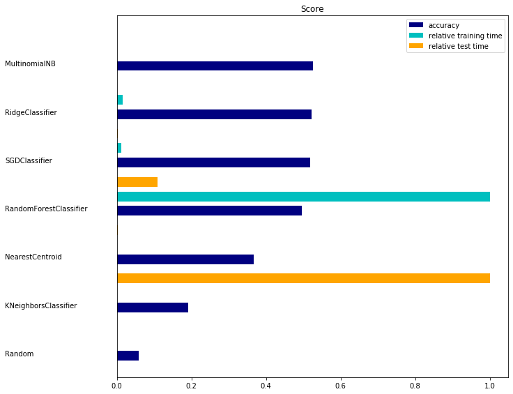

### Tailored Audiences on Twitter
*Insights from ~1,000,000 tweets about the 2016 Democratic National Convention*

#### Outline

 - Background
 - Data
 - Text Preprocessing
 - Identifying. and Labeling Groups
     - Network Analysis
     - K Means Clustering
 - Modeling 
     - Selection
     - Scores

### Process Overview



### Background 
Standard Audience Targeting: 
- Age
- Gender 
- Geography
- Generic interests (eg “shopping”, “sports”)

My Tailored Audiences:
- Mothers who are fans of Michelle Obama
- Men who are fathers and religious
- Teenagers who support Bernie Sanders
- etc...


### Network Analysis

**Methods**

- 1.) Create a graph where points represent users and lines represent conversations (tweets)
- 2.) Nodes are grouped into communities based on the frequency of their interactions with other users (mentions, replies)
- 3.) For each community, extract the keywords that define it using TF-IDF
- 4.) Hand Label the communities

**Labels**

-  Bernie supporters, progressives who are talking  about a politicla revolution. Anti-war, justice and unity
-  Women, Mothers, Black, talking about Michelle bama
-  Mainstreams anchors hournalists hosts, mostly at CNN
-  Men, fathers, dads, professionals in news media who are conservatives and talk about hillary
-  Mothers
-  religious conservatives
-  Journalists talking about the DNC chair debbie wazzerman schultz
-  Hispanic and Latinx Persons
-  Authors and writers
-  News people
-  Conservatives talking about donna brazille and implicating corruption, talking about wikileaks
-  Religious males (husbands) who work in media (radio
-  Muslim Persons 
-  Reporterrs
-  Teenagers, young latina 
-  Talking about mental illness and demi lovato (?)


### Network Graph 




### KMeans Clustering

**Methods**

- 1.) Using a pre-trained word2vec model trained on 2 billion tweets (stanford), vectorize text data (aka turn the words into a numerical representation)
-     ex: King - Man + Woman = Queen
- 2.) Use K-Means algorithm to group users that use similar language together
- 3.) Label each user with their assigned cluster
- 4.) Hand Label the clusters using topic modeling
- 5.) Reduce dimensions to vizualize the clusters in 2d

**Labels**
- Talking about Debbie Wasserman Schultz (unfavorably)
- Women discussing women’s issues
- Expressing concern about trump with the nuclear codes
- Talking about love, God, good vibes
- Watching the debate with friends, supporting Hillary Clinton
- Proud Americans
- Conservative sports fans
- Barack and Michelle Obama fans
- Barack and Michelle Obama fans
- Young people, Bernie Sanders supporters

### Train and Validate Models:

**Cluster Classifier Benchmarks**



**Community Classifier Benchmarks**




```python

```
