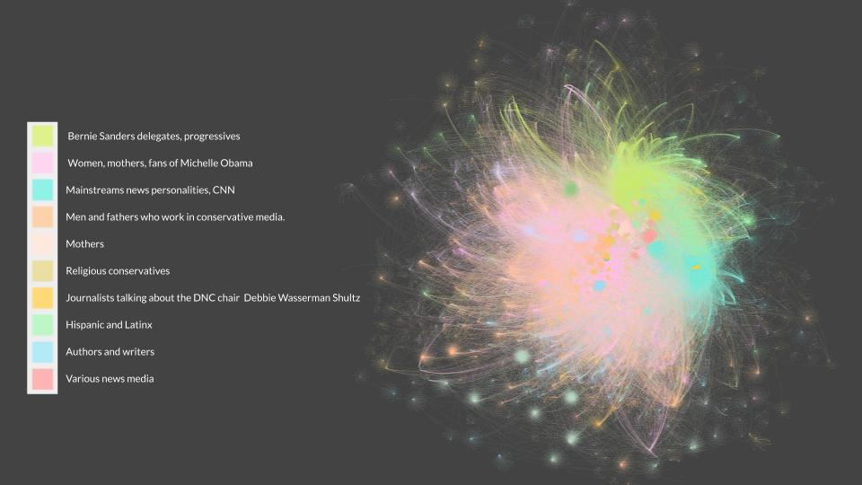

# Tailored Twitter Audiences

### Process Overview


### Identifying "Communities"

- 1.) Create a graph where points represent users and lines represent conversations (tweets)
- 2.) Nodes are grouped into communities based on the frequency of their interactions with other users (mentions, replies)
- 3.) For each community, extract the keywords that define it using TF-IDF
- 4.) Hand Label the communities

### Identifying "Clusters"

- 1.) Using a pre-trained word2vec model trained on 2 billion tweets (stanford), vectorize text data (aka turn the words into a numerical representation)
-     ex: King - Man + Woman = Queen
- 2.) Use K-Means algorithm to group users that use similar language together
- 3.) Label each user with their assigned cluster
- 4.) Hand Label the clusters using topic modeling
- 5.) Reduce dimensions to vizualize the clusters in 2d

### Results



### Model Accuracy: **55%**


```python

```
